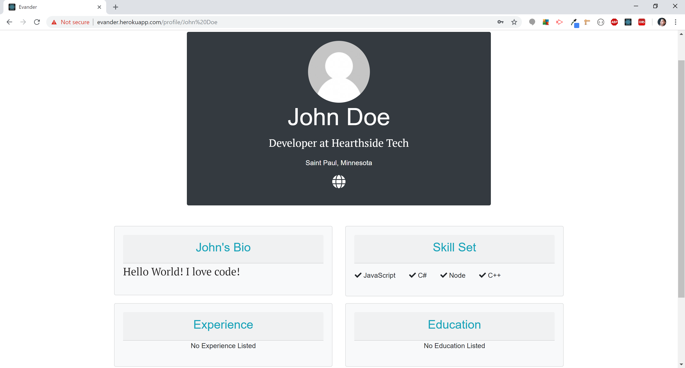
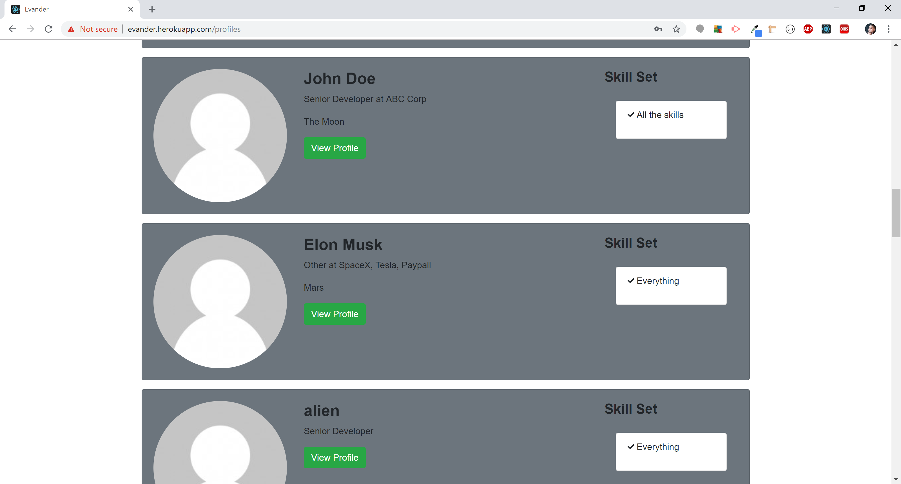
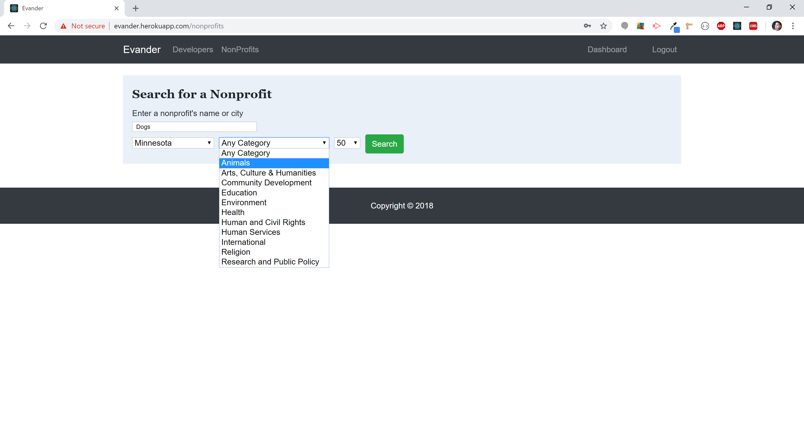
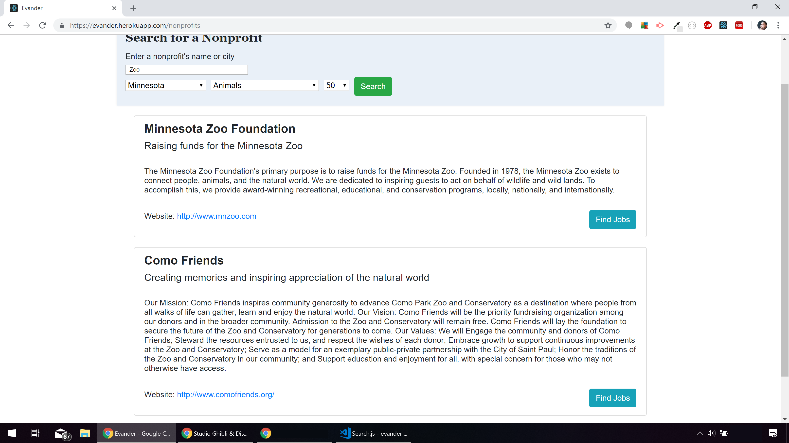

## Evander - A Social platform for Non-profits and Web Developers to connect.  

## Building the Source  

For prerequisites and detailed instructions please read the
[Installation Instructions]()on the Wiki.    
[Heroku Hosted Webstie](https://evander.herokuapp.com/)   
[Class Pressentation](https://docs.google.com/presentation/d/1JLiC8VEfI3IFGhRsLuWTv02OTJz4YJ49OUs85WG9qa8/edit#slide=id.g411324a08c_0_13/)   

## Introduction    

### About   
A social network app like Upwork, built for developers and non-profits.  Free to join and create a pulic profile.  Have a task or need as a non-profit, simply use the homepage to search our database of networked developers.  

### Target Audience   
Web Developers and local businesses and non-profits.  

### What is the problem to address   
Communication and coordination between interested parties. 

### What is the primary goal of the product    
Demonstration of an online website built on the MERN stack and provide an MVP to later build a local social networking platform for web developers and programmers.   

### Demo

## Our Design Approach    

### API Considerations   
Location of non-profits through google api may be added as a stretch goal. 

### Notable Libraries   
MongoDB
Express
React
bryptjs
mongoose
passport
nodemon

### Design Process   
Human-centered design is motivated by creating solutions for problems and opportunities through a focus on the needs, contexts, behaviors, and emotions of the people that the solutions will serve.   

Further Design decisions and processes can be found in the wiki page Design.   

## License   
	Evander was created for demonstration purposes only as part of the University of Minnesota's Web Development Bootcamp Course and not intended for commercial use.     

	Evander is licensed under the MIT License.   

